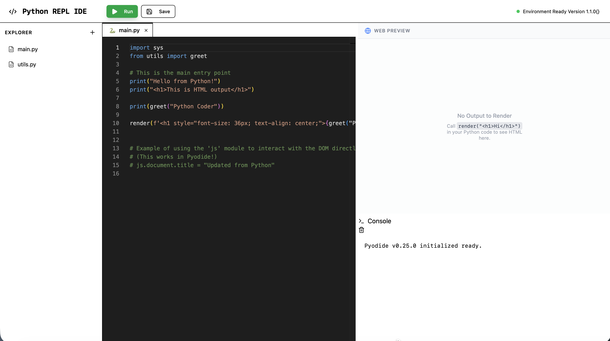

# Code Canvas — Python REPL IDE



A full-stack web-based IDE for executing Python code with an integrated REPL (Read-Eval-Print Loop). Built on **Astro 5** with server-side rendering, React 19 interactive islands, and a SQLite-backed file system. The app provides a modern development environment with a file explorer, Monaco code editor, console panel, and live web preview.

## Overview

This project started with inspiration from [Replit's](https://replit.com) "vibe coding" approach and has been customized with my own tweaks and adjustments to create a powerful, user-friendly Python development environment for the web. It was originally built with Vite + Express and has since been migrated to a full-stack **Astro 5** architecture — Astro handles routing, SSR, API endpoints, and static asset serving top-to-bottom.

## Features

- **Python REPL** — Execute Python code directly in the browser via Pyodide
- **Monaco Editor** — Full VS Code-quality code editing with syntax highlighting and IntelliSense
- **File Explorer** — Create, rename, and delete project files backed by a SQLite database
- **Console Panel** — View stdout, stderr, and debug output in real-time
- **Web Preview** — Instantly render HTML output from your code
- **Resizable Panels** — Drag to resize the editor, console, and preview panes
- **Modern UI** — React 19 + shadcn/ui component library with Tailwind CSS 4
- **Docker Support** — Multi-stage containerized builds with Docker Compose
- **AWS Deployment** — Automated 12-stage deployment pipeline (ECR, Lambda, API Gateway, CloudFront, Route 53)

## Tech Stack

### Full-Stack Framework

- **[Astro 5](https://astro.build)** — SSR framework with `output: 'server'` mode and the `@astrojs/node` adapter
- **[React 19](https://react.dev)** — Interactive UI islands via `@astrojs/react`
- **[TypeScript](https://www.typescriptlang.org)** — Type-safe development across the entire stack

### Frontend

- **[Tailwind CSS 4](https://tailwindcss.com)** — Utility-first styling via the `@tailwindcss/vite` plugin
- **[shadcn/ui](https://ui.shadcn.com)** — Radix UI-based component library
- **[Monaco Editor](https://microsoft.github.io/monaco-editor/)** — VS Code's editor in the browser
- **[TanStack React Query](https://tanstack.com/query)** — Server state management and caching
- **[Pyodide](https://pyodide.org)** — CPython compiled to WebAssembly for in-browser Python execution
- **[Lucide React](https://lucide.dev)** — Icon library

### Backend

- **[Astro API Routes](https://docs.astro.build/en/guides/endpoints/)** — REST endpoints under `src/pages/api/`
- **[Drizzle ORM](https://orm.drizzle.team)** — Type-safe SQL query builder
- **[better-sqlite3](https://github.com/WiseLibs/better-sqlite3)** — Embedded SQLite database
- **[Zod](https://zod.dev)** — Runtime schema validation (via `drizzle-zod`)

### DevOps

- **Docker** — Multi-stage Alpine builds
- **Docker Compose** — App + DB-init service orchestration
- **AWS** — ECR, Lambda, API Gateway v2, CloudFront, Route 53

## Getting Started

### Prerequisites

- **Node.js** v20 or higher
- **npm** v10 or higher
- **Docker** (optional, for containerized development/deployment)

### Installation

1. **Clone the repository**

   ```bash
   git clone https://github.com/faddah/code-canvas-astro.git
   cd code-canvas-astro
   ```

2. **Install dependencies**

   ```bash
   npm install
   ```

3. **Set up the database**

   Create a `.env` file in the project root:

   ```bash
   DATABASE_URL=file:./taskManagement.db
   ```

   Then push the schema to SQLite:

   ```bash
   npm run db:push
   ```

4. **Start the development server**

   ```bash
   npm run dev
   ```

   The application will be available at `http://localhost:4321`.

### Docker Setup

To run the application in Docker:

```bash
docker-compose up --build
```

This starts two services:

- **db-init** — Initializes the SQLite schema and seeds data, then exits
- **app** — Starts the production Astro server on port 3000

The database is persisted on a named Docker volume (`db-data`).

## Project Structure

```bash
code-canvas-astro/
├── src/
│   ├── assets/                # Images and media
│   ├── components/
│   │   ├── ui/                # shadcn/ui components (button, dialog, tabs, toast, etc.)
│   │   ├── App.tsx            # Root React app wrapper
│   │   ├── IDE.tsx            # Main IDE layout — explorer, editor, tabs, delete
│   │   ├── ConsolePanel.tsx   # Python stdout/stderr output
│   │   ├── FileTab.tsx        # Editor file tab bar
│   │   ├── WebPreview.tsx     # Live HTML preview iframe
│   │   └── QueryProvider.tsx  # TanStack React Query provider
│   ├── hooks/
│   │   ├── use-files.ts       # React Query hooks for file CRUD
│   │   ├── use-pyodide.ts     # Pyodide Python runtime hook
│   │   ├── use-toast.ts       # Toast notification hook
│   │   └── use-mobile.tsx     # Mobile viewport detection
│   ├── layouts/
│   │   └── Layout.astro       # Base HTML layout
│   ├── lib/
│   │   ├── db/
│   │   │   ├── index.ts       # SQLite connection + Drizzle setup
│   │   │   └── storage.ts     # DatabaseStorage class (CRUD operations)
│   │   └── utils.ts           # Utility helpers (cn, etc.)
│   ├── pages/
│   │   ├── index.astro        # Home page
│   │   ├── 404.astro          # Not found page
│   │   └── api/
│   │       └── files/
│   │           ├── index.ts   # GET    /api/files
│   │           ├── create.ts  # POST   /api/files/create
│   │           └── [id].ts    # GET | PUT | DELETE  /api/files/:id
│   ├── shared/
│   │   └── schema.ts          # Drizzle schema, Zod types, API endpoint definitions
│   ├── styles/
│   │   └── global.css         # Global Tailwind styles
│   └── types/                 # TypeScript type definitions
├── scripts/
│   ├── docker-entrypoint.sh   # Container startup script
│   ├── init-db.js             # DB initialization for Docker
│   └── seed-db.js             # DB seeding for Docker
├── migrations/                # Drizzle migration files
├── public/                    # Static assets (served at /)
├── astro.config.mjs           # Astro configuration (SSR, React, Tailwind, Node adapter)
├── drizzle.config.ts          # Drizzle ORM configuration
├── tsconfig.json              # TypeScript configuration
├── tailwind.config.ts         # Tailwind CSS theme customization
├── Dockerfile                 # Multi-stage production build
├── Dockerfile.db              # Database initialization image
├── docker-compose.yml         # App + DB-init service orchestration
├── update_aws_deployment.py   # 12-stage AWS deployment script
└── package.json               # Dependencies and scripts
```

## Available Scripts

| Command                | Description                          |
| ---------------------- | ------------------------------------ |
| `npm run dev`          | Start Astro dev server with HMR      |
| `npm run build`        | Build for production (SSR)           |
| `npm run preview`      | Preview the production build locally |
| `npm start`            | Run the built production server      |
| `npm run db:push`      | Push Drizzle schema to SQLite        |
| `npm run db:generate`  | Generate Drizzle migration files     |
| `npm run db:migrate`   | Run pending migrations               |
| `npm run db:studio`    | Open Drizzle Studio (database GUI)   |
| `npm run lint`         | Run ESLint                           |

## API Endpoints

| Method   | Endpoint             | Description                          |
| -------- | -------------------- | ------------------------------------ |
| `GET`    | `/api/files`         | List all files                       |
| `POST`   | `/api/files/create`  | Create a new file                    |
| `GET`    | `/api/files/:id`     | Get a single file by ID              |
| `PUT`    | `/api/files/:id`     | Update a file's name and/or content  |
| `DELETE` | `/api/files/:id`     | Delete a file                        |

## Credits

This project was inspired by [Replit's](https://replit.com) innovative "vibe coding" approach, which provided the initial foundation and philosophy for this IDE. The core implementation and additional features, optimizations, and customizations have been developed and refined independently to create this unique Python REPL IDE experience.

## License

MIT

## Contact & Links

- **GitHub:** [github.com/faddah/code-canvas-astro](https://github.com/faddah/code-canvas-astro)
- **Live Site:** [pyrepl.dev](https://pyrepl.dev)
- **Email:** [my_biz@me.com](mailto:my_biz@me.com)

---

&copy; 2025 Faddah Wolf. All rights reserved.
